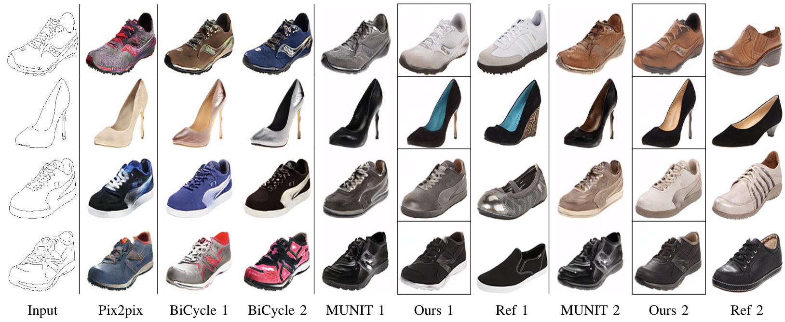
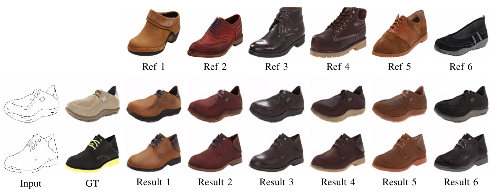
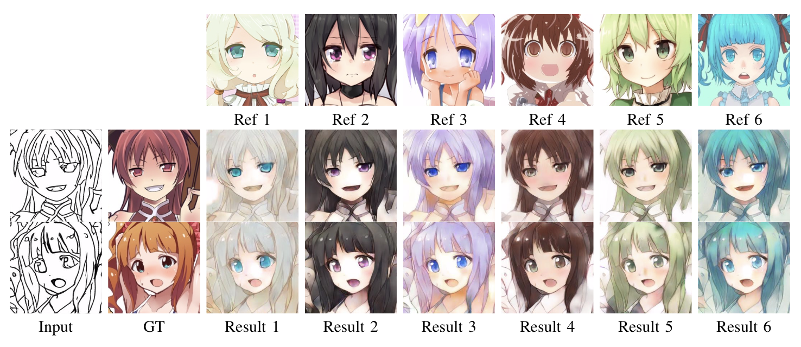
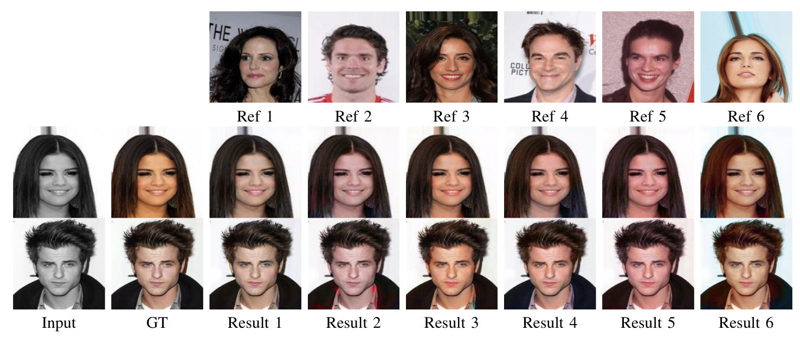

# SEGIN: Semantic Example based Image-to-Image translation Network
The paper can be found [here](https://arxiv.org/abs/1909.13028)
#### Dependency
Some related tool versions are similar to the [MUNIT](https://github.com/NVlabs/MUNIT/blob/master/USAGE.md) codebase: yaml, tensorboard (from https://github.com/dmlc/tensorboard), and tensorboardX (from https://github.com/lanpa/tensorboard-pytorch).
* Linux Ubuntu 16.04
* python=3.6
* pytorch=0.4.0  
* GPU + CUDA cuDNN
#### Framework and Results

Results comparison

Edges-to-shoes

Edges-to-anime

Face colorization

#### Get Started
##### Clone the code repository
```
git clone https://github.com/HideUnderBush/SEGIN.git
cd SEGIN/
```

##### Data Preparation
In our experiment, we use the [edges2photos dataset](https://github.com/junyanz/pytorch-CycleGAN-and-pix2pix/blob/master/docs/datasets.md#pix2pix-datasets) (edge2shoes, edge2bags) same as the [pix2pix](https://github.com/junyanz/pytorch-CycleGAN-and-pix2pix). Besides, the anime dataset can be download [here](https://www.kaggle.com/azathoth42/myanimelist), the anime dataset used in [DRIT](https://www.google.com/url?sa=t&rct=j&q=&esrc=s&source=web&cd=1&cad=rja&uact=8&ved=2ahUKEwiG5c_up6jlAhXNP3AKHZ_TA6AQFjAAegQIBRAB&url=https%3A%2F%2Fgithub.com%2FHsinYingLee%2FDRIT&usg=AOvVaw0gtq2Y4xBpU9iApHSOd4FX) are also recommended. For the anime data, we first use an open resource algorithm to detect and crop the anime face, and then we used [HED](https://github.com/s9xie/hed) to extract the edges of the anime. If data in [DRIT](https://www.google.com/url?sa=t&rct=j&q=&esrc=s&source=web&cd=1&cad=rja&uact=8&ved=2ahUKEwiG5c_up6jlAhXNP3AKHZ_TA6AQFjAAegQIBRAB&url=https%3A%2F%2Fgithub.com%2FHsinYingLee%2FDRIT&usg=AOvVaw0gtq2Y4xBpU9iApHSOd4FX) are used for training, then there is no need to crop the face images.

##### Training and testing
Modify the ``path`` in the ``train.py`` to save the model and middle results, parameters can also be modified.
``python train.py``
Similarly, modify the path for files I/O, simply use ``python test.py`` to generate test results.
This is a draft version of code for review, a refined one will come up soon, which will support more options with higher flexibility.
